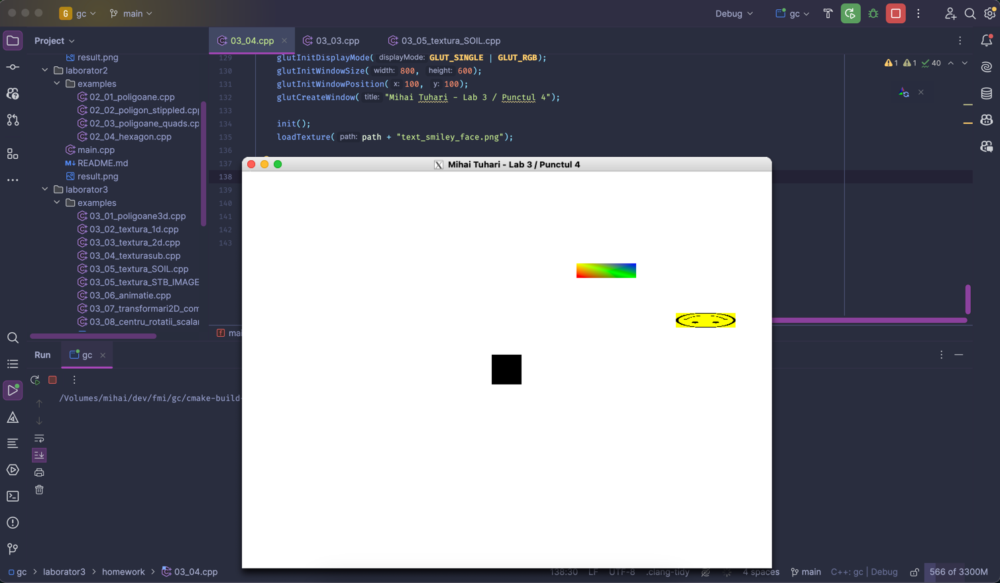

## Tema 3 / Animatii, texturi
#### 16/11/2024

### Cerinta
Solutiile vor fi trimise pe chat-ul individual de pe MSTeams pana pe 25.11.2024.
Trimiteti o imagine care sa includa (i) rezultatul, (ii) fragmentul de cod sursa relevant.

1) (1p) Modificati un element legat de miscare in codul sursa `03_06_animatie.cpp` (de exemplu deplasarea este de-a
lungul axei Oy, se schimba sensul rotatiei patratului rosu, etc.)

2) (1p) Desenati un patrat care se rostogoleste de-a lungul unei axe.

3) (2p) Folositi liste de display (codul sursa `02_04_hexagon.cpp`) si codul sursa "dreptunghi cu satelit" (`03_06_animatie.cpp`) 
pentru a crea un minisistem solar (stea / planeta / satelit).

4) (2p, din care 1p pentru ordinea corecta a transformarilor) Desenati un patrat centrat in origine, avand latura egala cu 30.
Utilizati apoi o scalare cu factori (2.0, 0.5) si o translatie de vector (100,100).
Desenati, in plus, in acelasi desen (atentie la ordinea transformarilor!):
   • cu un amestec de culori ceea ce se obtine aplicand intai scalarea, apoi translatia
   • texturat ce se obtine aplicand intai translatia, apoi scalarea.

5) (2p/3p) Adaugati o textura intr-unul din desenele realizate la o tema anterioara (se acorda 2p pentru un desen
"static", respectiv 3p pentru un desen "dinamic" animat).

### Rezolvari
👇 **Click pe fiecare tema pentru detalii, cod si video.**

  
Punctul 1 - 📉 translatat cuburi pe Oy

Rezolvare in [homework/03_01](homework/03_01.cpp)

https://github.com/user-attachments/assets/0fc88197-5baf-4d9f-81b4-c129c8df9c5e

  
Punctul 2 - 🟥 patrat rostologit pe Ox

Rezolvare in [homework/03_02](homework/03_02.cpp)

https://github.com/user-attachments/assets/f1050217-b697-47fe-b98f-a2fa9c0a8467

  
Punctul 3 - ✨ mini sistem solar ☀️🌎🌘

Rezolvare in [homework/03_03](homework/03_03.cpp) cu exta stelute pe fundal.

https://github.com/user-attachments/assets/8a03c6ff-4529-440a-b087-b4bef194d131

  
Punctul 4 - 📐 scalare si translatie

Rezolvare in [homework/03_04](homework/03_04.cpp).

  
Punctul 5 - 🌲 texturare si animat tema anterioara

Rezolvare in [homework/03_05](homework/03_05.cpp), ca extensie a [laborator2/main.cpp](../laborator2/main.cpp).

Am texturat si animat copacii de jos, dar am sters restul poligoanelor si triunghiurilor.

https://github.com/user-attachments/assets/31e0108b-968c-4c3f-8998-b67a6a974ff1

