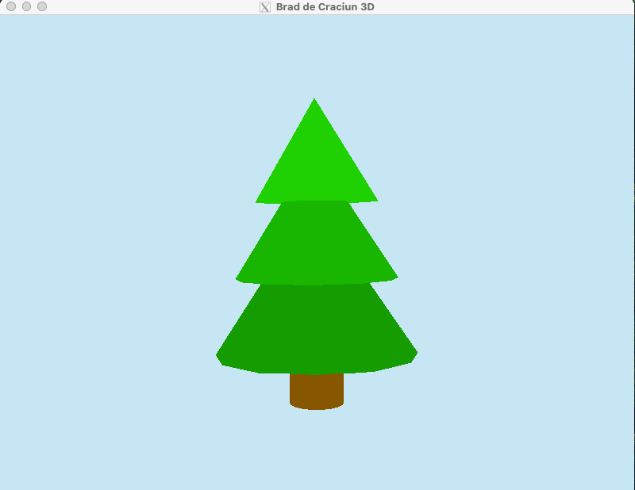

## Tema 4 / Obiecte 3D
#### 12/12/2024

### Cerinta

Solutiile vor fi trimise pe chat-ul individual de pe MSTeams pana pe 16.12.2024.
Trimiteti o imagine care sa includa (i) rezultatul, (ii) fragmentul de cod sursa relevant.

1) (max 2p) Creati un obiect 3D care sa modeleze un obiect real folosind cel putin doua obiecte disponibile in biblioteca `glut`.

2) (2p) Survolati obiectul creat (folosind modelul cu cubul texturat din codul sursa `05_04_cub_texturat_survolare.cpp`). 
Nu este necesar sa aplicati textura pe obiectul considerat.

3) (1p) Modificati raza sferei de survolare folosind tastele `-` si `+`.

### Rezolvare
Rezolvare in [main.cpp](main.cpp)

https://github.com/user-attachments/assets/f031d775-3a57-4e42-a029-e3a0494ae07c
