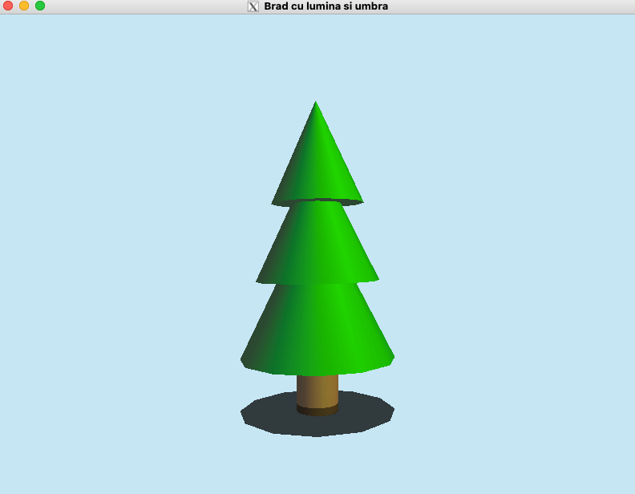
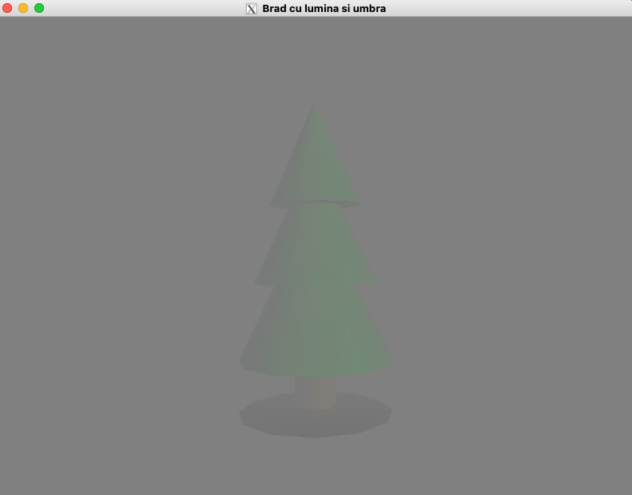
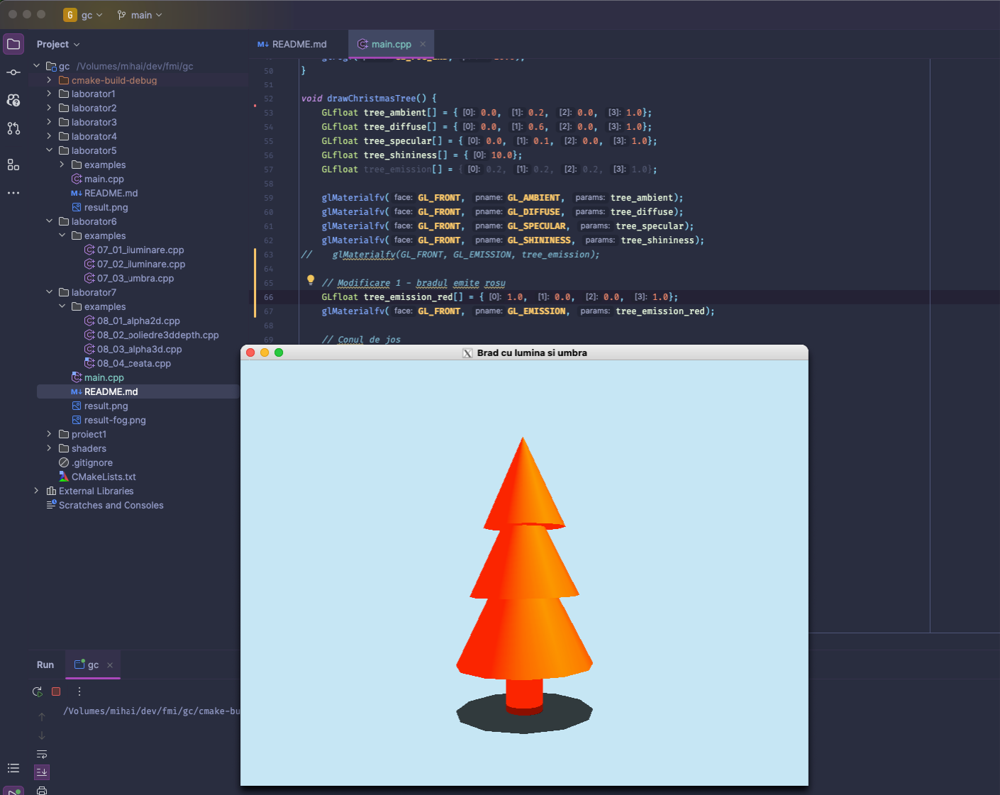
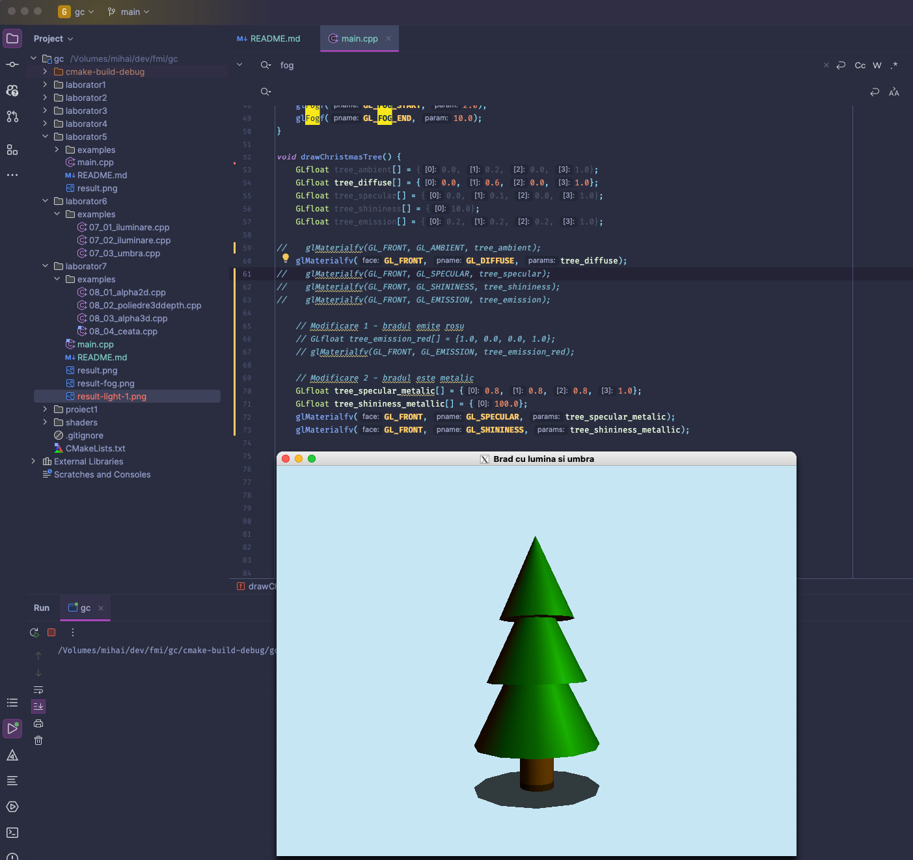
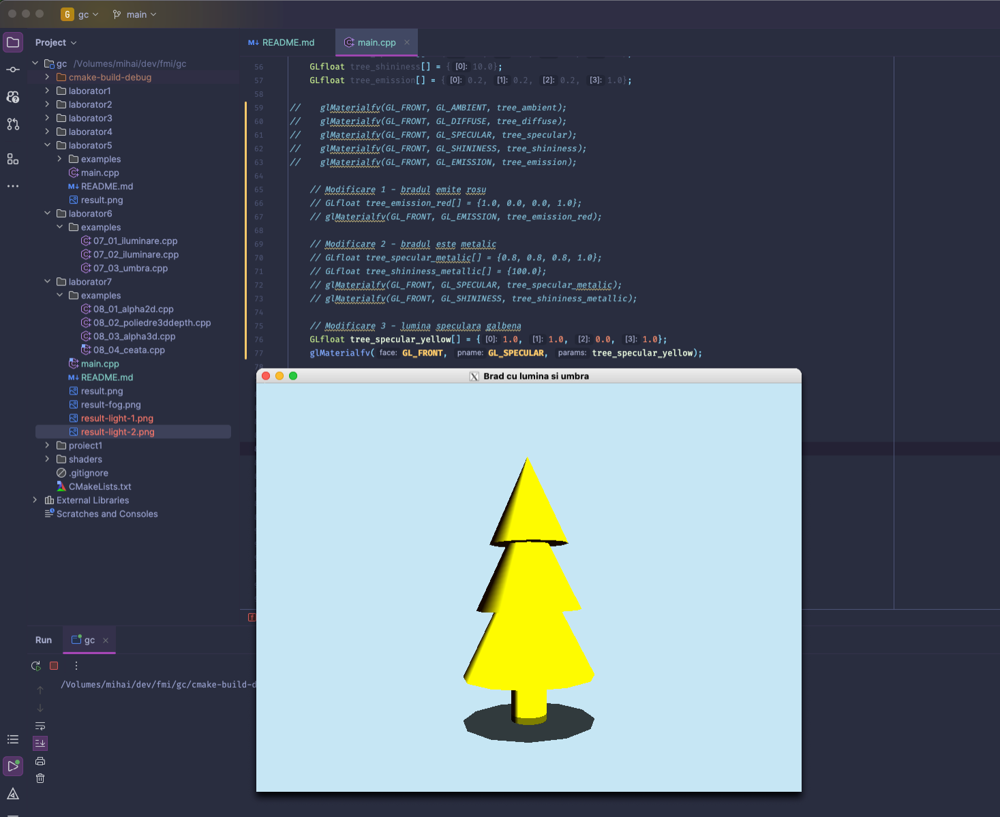
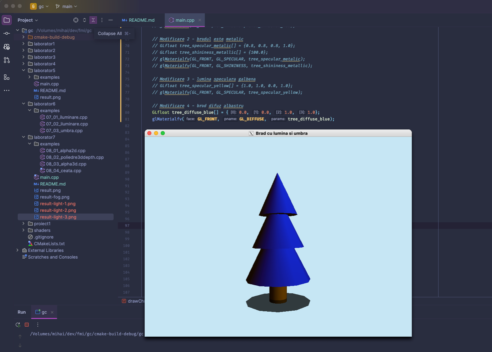

## Tema 5 / Iluminare. Efecte vizuale.
#### 16/12/2024

### Cerinta

Solutiile vor fi trimise pe chat-ul individual de pe MSTeams pana pe 23.12.2024.
Trimiteti o imagine care sa includa (i) rezultatul, (ii) fragmentul de cod sursa relevant.

1) (2p) Aplicati iluminarea in cazul obiectului 3D creat.

2) (2p) In codul de la punctul 1 modificati patru parametri ai modelului de iluminare si comentati rezultatul obtinut.
(maxim 1 rand/comentariu).

3) (1p) Aplicati umbra pentru obiectul 3D creat.
4) (1p) In aceeasi scena, introduceti efectul de ceata

### Rezolvare
Rezolvare in [main.cpp](main.cpp)

 

Modificari aduse pentru iluminare:

#### Brad rosu

#### Brad metalic

#### Lumina speculara galbena

#### Brad difuz albastru

https://github.com/user-attachments/assets/ec470f39-db52-45f0-8dcb-f4b481b07299
