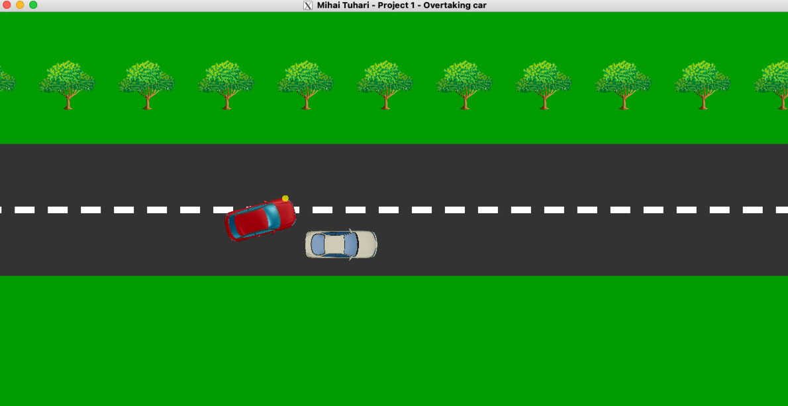
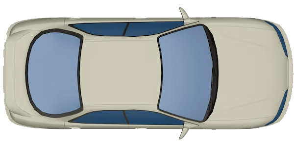
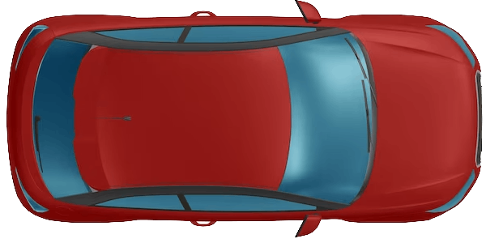
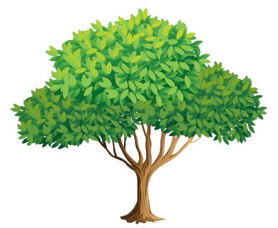
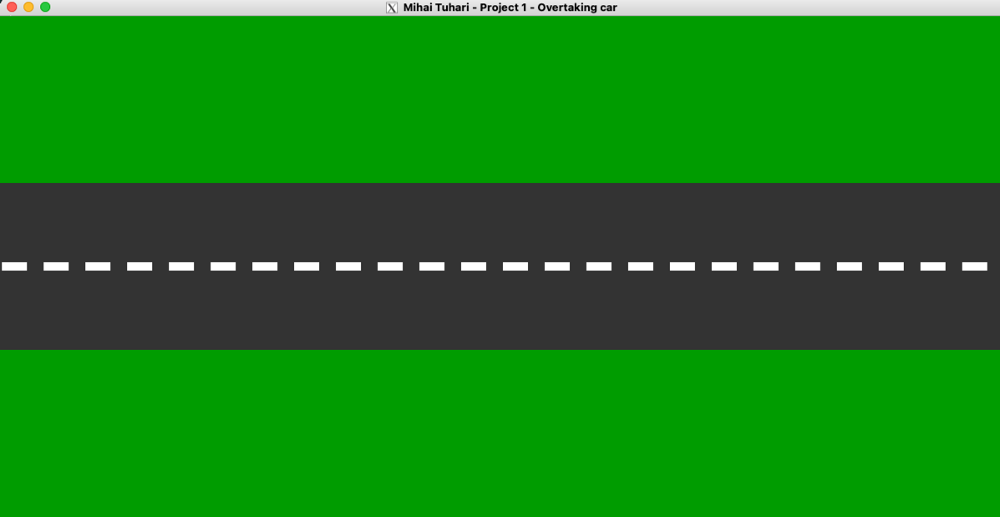
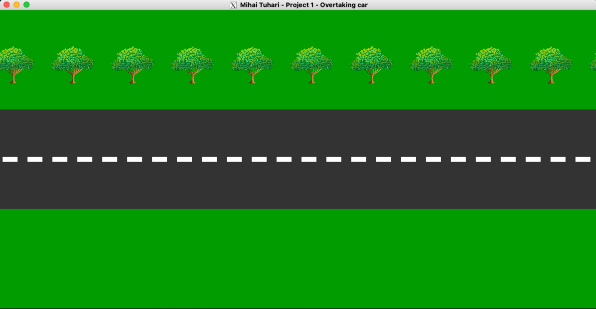

# Proiect 1 / 2D
#### Noiembrie 2024 / Mihai Tuhari

## Cerinta
Dezvoltati un proiect 2D pentru tema aleasa.

Simulati o **"depasire"**: o masina / un dreptunghi se deplaseaza uniform (prin translatie), un alt dreptunghi
vine din spate (tot prin translatii/rotatii), la un moment dat intra in depasire, apoi trece in fata primului.

🚙 🚗💨 🌲🌲🌲🌲

  
Precizari cerinta

1. Aplicatia este insotita de o scurta documentatie. In documentatie vor fi prezentate pe scurt (i) conceptul proiectului; (ii) ce transformari au fost incluse; (iii) de ce este original? (iv) capturi de ecran (cod, rezultat) relevante; (v) contributii individuale (daca este cazul).
2. Detaliere punctaj: 3p realizare proiect; 3p originalitate/dificultate/elemente incluse; 3p discutii/prezentari; 2p documentatie.
3. Proiectul poate fi realizat in echipa (recomandat: 1-4 membri, sa fie anuntate din timp!). In acest caz documentatia va sublinia contributia individuala.

--------

# Implementare

## Demo
Pentru o lectura mai coerenta si simpla asupra documentatiei de mai jos, incepem cu o captura de ecran a intregului proiect:

## Introducere
Am realizat o simulare a unei depasiri intre doua masini, folosind OpenGL si C++.

Programul principal este in fisierul [proiect1.cpp](proiect1.cpp) si foloseste [libraria STB](libs/stb_image.h) pentru incarcarea texturilor.

## Texturi
Pentru manipularea texturilor am ales STB in loc de SOIL pentru ca pe MacOS SOIL nu este compatibil.

Texturile se regasesc in folderul [textures](textures) si sunt fisiere PNG cu fundal transparent, afisate si mai jos:

  

## Conceptul
Animatia este creata din mai multe componente cu roluri diferite:

### Scena statica
Scena este un dreptunghi care reprezinta drumul pe care se deplaseaza masinile. 
Este desenat cu culoarea verde iar asfaltul este gri.

  
📸 Screenshot scena

### Decor dinamic
🛣️ Pentru a simula miscarea, am adaugat un **marcaj** discontinuu pe mijlocul drumului prin functia `drawRoad()`.
Aceasta genereaza dreptunghiuri albe cu o anumita distanta intre ele.

🌲 In partea superioara sunt desenati **copaci** tot pentru a simula miscarea si pentru un plus de complexitate.
Acestia sunt adaugati prin `drawTrees()` si sunt dreptunghiuri ce se repeta pe latimea ecranului si au proportii 39x32
peste care se aplica textura [tree.png](textures/tree.png) cu optiunile de blending `GL_SRC_ALPHA` si `GL_ONE_MINUS_SRC_ALPHA`
pentru a afisa doar textura.

  
📸 Screenshot decor

### Masinile
Sunt adaugate 2 masini care se deplaseaza pe scena cu functia `drawCar()`.

- Masina 1 este cea inceata
- Masina 2 este cea rapida

Acestea sunt dreptunghiuri cu proportii 100x55 peste care se aplica texturile [car1.png](textures/car1.png) si [car2.png](textures/car2.png)
cu optiuni de blending similare celor de la copaci.

### Semnalizarea
Masina 2 are atasat si conceptul de "semnalizare" pentru a indica depasirea. 🟡

Semnalizarea este un singur cerc galben (facut cu helperul `drawCircle()`) cu transparenta 70% ce este atasat de masina.
Aceasta este o singura instanta si in functie de valoarea `blinkersOn` _(0=oprit, 1=stanga, 2=dreapta)_ isi schimba pozitia pe axa Y fata de masina.

Programatic, am simulat o semnalizare apropiata de un **comportament real**:
- Semnalizarea de depasire (stanga) este pornita cand mai sunt 2 lungimi de masina pana la masina din fata
- Pe timpul depasirii, semnalizarea de depasire ramane pornita
- Dupa ce masina lenta a fost intrecuta cu o lungime de masina, este pusa semnalizare de revenire (dreapta)

### Depasirea
In timpul schimbarii de banda, masina 2 schimba banda pe axa Y cu o anumita viteza si unghi de rotatie.
La revenire, masina 2 se intoarce la banda initiala.

--------

## Aspecte tehnice

### Design modular
Am abordat proiectul cu un design modular si am incercat sa folosesc cat mai multe functii pentru a separa logica.

### Configurabilitate
Animatia este usor configurabila din variabilele globale definite la inceputul fisierului [proiect1.cpp](proiect1.cpp).

Acolo regasiti variabile pentru:
- Globale (dimensiune extra, PI pentru cercuri)
- Texturi (cale fisiere, ID-uri, etc)
- Masini (pozitii initiala, viteze de deplasare, dimensiuni)
- Depasire (rotatie, rotatie maxima, buffer siguranta revenire din depasire)
- Drum (grosime marcaj, spatiere copaci)
- Scena (viteza animatie, interval repetare)

### Transformari
Pentru a realiza animatia, am folosit urmatoarele transformari:
- Translatie
- Rotatie

Cand o masina ajunge la capatul ecranului, aceasta este repusa la inceputul drumului.

### Limba
Intreg codul (cu tot cu comentarii), este scris in limba Engleza din motive de coerenta si simplitate, pentru a
evita combinatia intre termeni in limba Romana si Engleza.

### Video
Mai jos este un video cu animatia in actiune:

https://github.com/user-attachments/assets/fc02d11f-a344-4455-b8ed-20c73d5e48cb
