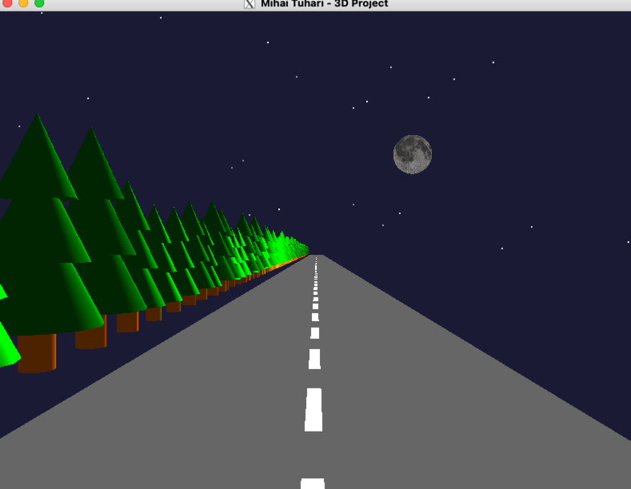

# Proiect 2 / 2D
#### Ianuarie 2025 / Mihai Tuhari

## Cerinta
Realizati o scena 3D complexa.

### Precizari cerinta

1. Aplicatia este insotita de o scurta documentatie. In documentatie vor fi
   prezentate succint (i) conceptul proiectului; (ii) punctual: elementele care au fost
   incluse; (iii) de ce este original? (iv) capturi de ecran (cod, rezultat) relevante; (v)
   contributii individuale (pentru proiectele realizate in echipa).
2. Detaliere punctaj:
   - (max)5p proiect care sa reprezinte o scena 3D "cu sens" si care include
      tehnici deja implementate (reprezentare obiecte 3D, iluminare, umbre,
      amestecare, texturare, transformari, etc. – pentru fiecare tehnica utilizata va
      fi acordat 1p, tehnicile vor fi prezentate la pct. (ii) mai sus);
   - (max)2p elemente mai dificile, neprezentate la curs/laborator;
   - 2p originalitate+complexitate,
   - 3p documentatie (inclusiv calitatea documentatiei, respectarea punctelor de
      mai sus),
   - 2p prezentare la laborator/discutii.
3. Indicatii submitere: Veti submite un singur fisier PDF care va cuprinde
   documentatia; la final indicati resursele utilizate.

--------

# Implementare

## Demo
Pentru o lectura mai coerenta si simpla asupra documentatiei de mai jos, incepem cu o captura de ecran a proiectului.

La sfarsit regasiti si un video.

## Introducere
Am realizat o simulare a unui drum in miscare. Soseaua are marcaj rutier pe mijloc, iar pe marginea drumului sunt copaci
de diverse dimensiuni ce se misca cu aceeasi viteza.

Se mai poate distinge luna din coltul scenei.

Programul principal este in fisierul [proiect2.cpp](proiect2.cpp) si foloseste [libraria STB](libs/stb_image.h) pentru incarcarea texturii pentru luna.

--------

# Specificatii scena

## Texturi
Pentru manipularea texturilor am ales STB in loc de SOIL pentru ca pe MacOS SOIL nu este compatibil.

Textura folosita pentru luna se regaseste in folderul [textures](textures):

## Copacii 🌲
Brazii de pe marginea drumului sunt realizati fiecare din catre 3 conuri si un cilindru pentru trunchi.
Pentru dinamism si originalitate, fiecare copac are aplicat un factor de scalare intre 0.8 si 1.2.

## Luna 🌕
Luna este o sfera cu o textura aplicata, impreuna cu setari pentru iluminare puternica.

## Marcajul rutier 🛣️
Acesta este format din dreptunghiuri albe cu o anumita distanta intre ele.

## Animatie 🚗
Pentru a simula miscarea, am folosit o variabila `roadOffset` care se modifica la fiecare frame cu valoarea constantei `ROAD_SPEED`.

--------

# Specificatii control si camera

## Control camera 🎥
Unghiul implicit este cel afisat in prima imagine.

Folositi `sagetile` si tastele `+` si `-` pentru a roti camera si a da zoom in/out.

Apasati tastele `1`, `2`, `3`, `4` pentru a schimba intre camerele presetate.

 

  

## Ceata 🌫️
Apasati tasta `F` pentru a activa/dezactiva ceata.
Ceata este randata de la inceput dar este dezactivata din flag-ul `fog = false`.

--------

## Aspecte tehnice

### Design modular
Am abordat proiectul cu un design modular si am incercat sa folosesc cat mai multe functii pentru a separa logica.

### Configurabilitate
Animatia este usor configurabila din variabilele globale definite la inceputul fisierului [proiect2.cpp](proiect2.cpp).

Acolo regasiti variabile pentru:
- Camera implicita
- Ceata (flag)
- Dimensiune si viteza drum

### Limba
Intreg codul (cu tot cu comentarii), este scris in limba Engleza din motive de coerenta si simplitate, pentru a
evita combinatia intre termeni in limba Romana si Engleza.

### Video
Mai jos este un video cu animatia in actiune:

https://github.com/user-attachments/assets/2f2f8c63-0511-4e7c-a036-5b043ae0e2ed
