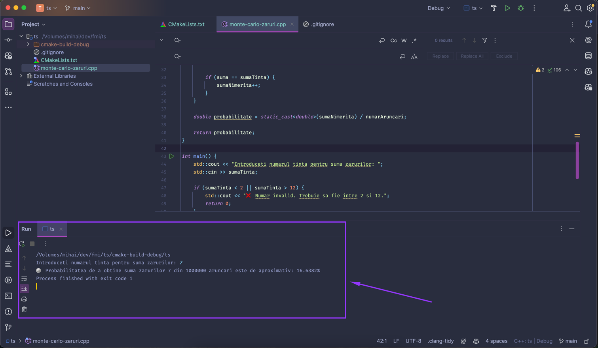

## Tehnici de simulare
### Proiect 1 - Monte Carlo

#### Descriere solutie
Acest program simuleaza aruncarea a două zaruri de un numar setat de un milion de ori si calculeaza probabilitatea ca suma celor doua zaruri sa fie egală cu un numar introdus de la tastatura.

#### Pasii programului
1. Solicita utilizatorului sa introduca un numar tinta pentru suma celor doua zaruri, avand valoare intre 2 si 12.
2. Simuleaza aruncarea a doua zaruri pentru fiecare din numarul de aruncări specificat. Aceasta este o metoda de simulare Monte Carlo, in care generam o serie de aruncari aleatorii
pentru a estima probabilitatea unui eveniment (suma sa fie cea introdusa).
3. Verifica dacă suma obținuta este cea introdusa si numara de cate ori se intampla acest lucru.
4. Calculeaza probabilitatea ca suma să fie cea introdusa, afisand rezultatul ca procentaj.

#### Implementare
Vedeti fisierul [monte-carlo-zaruri/main.cpp](main.cpp) pentru codul sursa.

#### Compilare si rulare
Rezultatul compilarii si rularii programului este:

