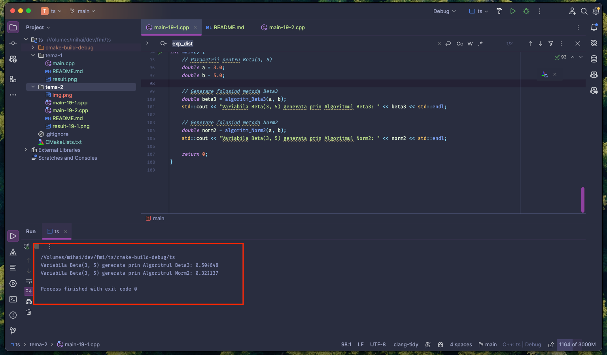
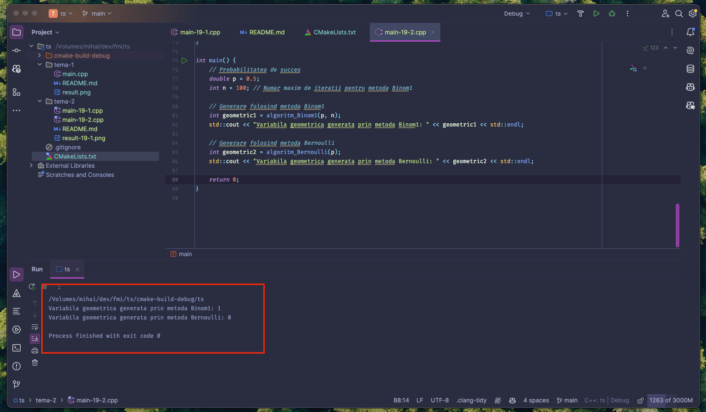

## Tehnici de simulare
### Proiect 2

#### Cerinta numarul 19
1. Sa se genereze variabila `Beta(3, 5)` prin doua metode (curs 6).
2. Sa se genereze variabila geometrica prin doua metode (curs 7).

------

#### Partea 1
Cerinta spune:
> Sa se genereze variabila `Beta(3, 5)` prin doua metode (curs 6).

Am ales sa folosesc algoritmii `Beta3` si `Norm2`, descrisi mai jos:

```
 Algoritmul Beta3

 → Intrare: 0 < a, b < 1
 → P1: Se genereaza U1,U2 ∼ U(0, 1) independente;
 → P2: V = U1 ^1/a, T = U2 ^1/b;
 → P3: Daca V + T < 1 mergi la P4, altfel mergi la P1;
 → P4: X := V / (V+T);
 → Iesire: Variabila aleatoare X.
```

```
 Algoritmul Norm2

 → Intrare:
 → P1: Se genereaza U ∼ U(0, 1);
 → P2: Se genereaza Y ∼ Exp(1);
 → P3: Daca U ≤ e^(-Y^2 / 2 + Y - 0.5) mergi la P4, altfel mergi la P1;
 → P4: X1 := Y;
 → P5: Se genereaza U ∼ U(0, 1);
 → P6: Daca U ≤ 0.5 atunci s = 1, altfel s := −1;
 → P7: X := sX1;
 → Iesire: Variabila aleatoare X.
```

#### Implementare
Vedeti fisierul [tema-2/main-19-1.cpp](main-19-1.cpp) pentru codul sursa.

#### Compilare si rulare
Rezultatul compilarii si rularii programului este:


------

#### Partea 2
Cerinta spune:
> Sa se genereze variabila geometrica prin doua metode (curs 7).

Am ales sa folosesc algoritmii `Binom1` si `Bernoulli`, descrisi mai jos:

```
 Algoritmul Binom1

 → Intrare: n, p
 → P1: i = 1, X = 0;
 → P2: Se genereaza Z_i ∼ Bern(p), X := X + Z_i;
 → P3: Daca i = n stop, altfel i := i + 1, mergi la P2;
 → Iesire: Variabila aleatoare geometrica X.
```

```
 Algoritmul Bernoulli

 → Intrare: Probabilitatea de succes p
 → P1: Se genereaza U ∼ U(0, 1);
 → P2: Daca U ≤ 1 - p atunci Z = 0, altfel Z = 1;
 → Iesire: Variabila aleatoare Z.
```

#### Implementare
Vedeti fisierul [tema-2/main-19-2.cpp](main-19-1.cpp) pentru codul sursa.

#### Compilare si rulare
Rezultatul compilarii si rularii programului este:


