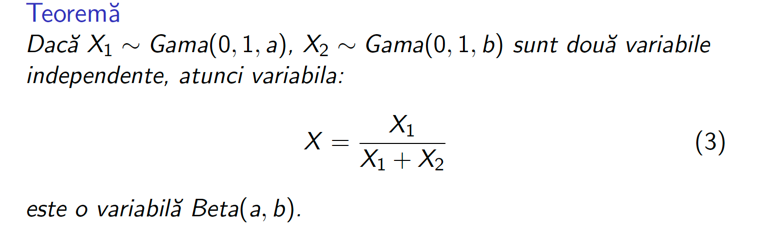
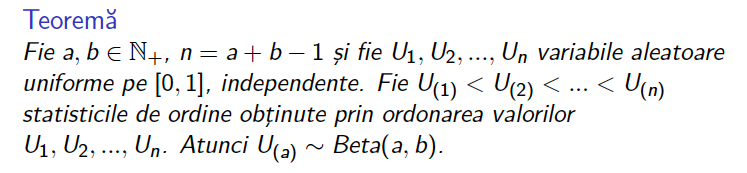
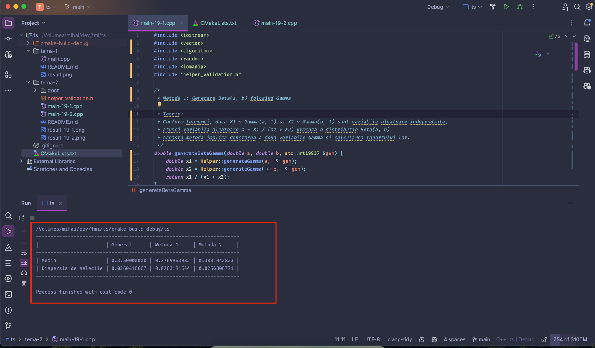
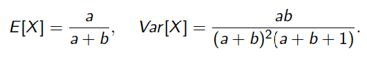
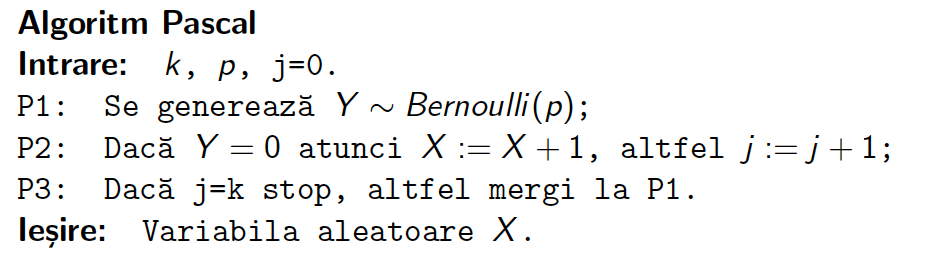
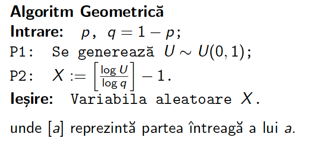
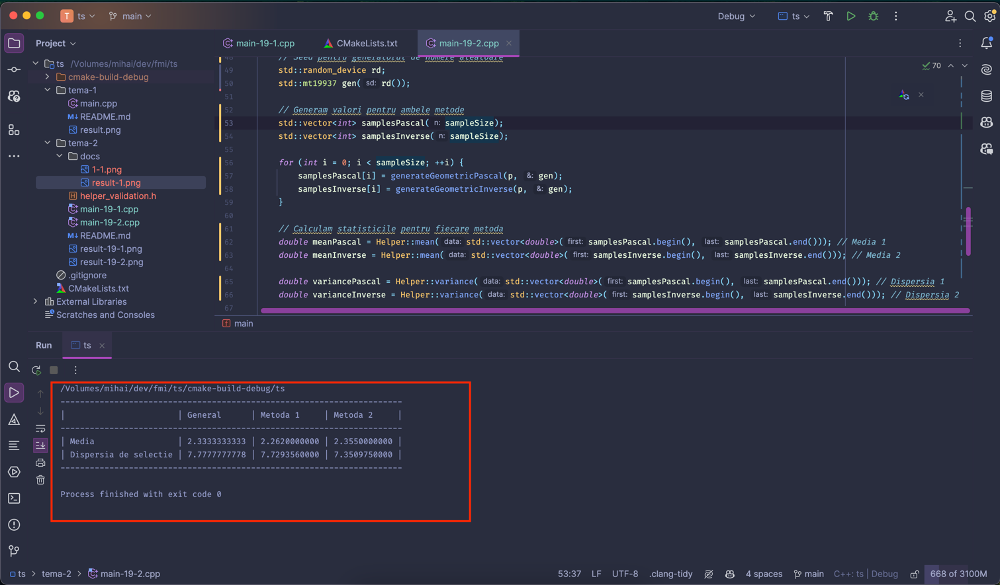

## Tehnici de simulare
### Proiect 2

#### Cerinta numarul 19
1. Sa se genereze variabila `Beta(3, 5)` prin doua metode (curs 6).
2. Sa se genereze variabila geometrica prin doua metode (curs 7).

------

### Partea 1

#### Cerinta
Cerinta spune:
> Sa se genereze variabila `Beta(3, 5)` prin doua metode (curs 6).

##### Metode alese

###### Metoda 1

###### Metoda 2

#### Implementare
Codul sursa al celor doua metode este in fisierul [tema-2/main-19-1.cpp](main-19-1.cpp).

#### Compilare si rezultat
Rezultatul compilarii si rularii programului este:

#### Testare
Pentru a testa corectitudinea metodelor, am folosit:

------

### Partea 2

#### Cerinta spune:
> Sa se genereze variabila geometrica prin doua metode (curs 7).

##### Metode alese

###### Metoda 1

###### Metoda 2

#### Implementare
Codul sursa al celor doua metode este in fisierul [tema-2/main-19-2.cpp](main-19-2.cpp).

#### Compilare si rezultat
Rezultatul compilarii si rularii programului este:

