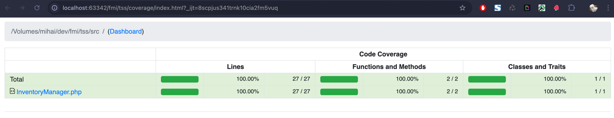
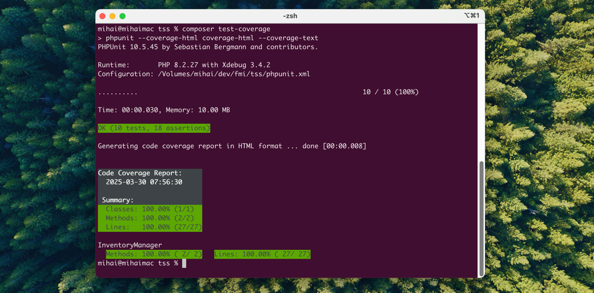
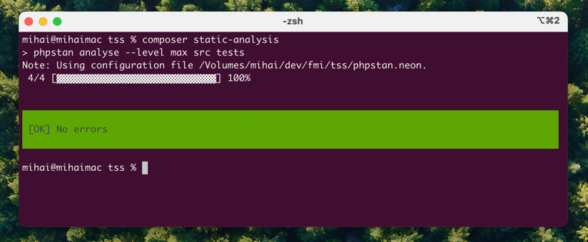

# Testare Unitară în PHP - InventoryManager

Acest proiect conține o implementare simplă a unui **backend PHP** cu două
funcționalități și testele unitare asociate.

Testele sunt scrise folosind PHPUnit și acoperă atât **testarea funcțională**,
cât și **testarea structurală**, conform cerințelor cursului *Testarea Sistemelor Software*.

## 🚀 TL;DR

Pentru a rula toate verificările dintr-un singur pas, execută:

```sh
./test.sh
```

Scriptul va rula:
- ✅ testele unitare cu acoperire (`composer test-coverage`)
- 🔍 analiza statică cu PHPStan (`composer static-analysis`)
- 🔎 analiza statică cu Psalm (`composer static-psalm`)
- 🧬 mutation testing cu Infection (`composer mutation`)

-------

## 🛠️ Configurare și rulare

Rulează `composer install` pentru a instala dependințele proiectului.

Apoi, pentru a rula testele, folosește comanda `composer test`.

Suplimentar, poți rula `vendor/bin/phpunit --testdox` pentru a vedea rezultatele testelor într-un format ușor de citit.

```
vendor/bin/phpunit --testdox
PHPUnit 10.5.45 by Sebastian Bergmann and contributors.

Runtime:       PHP 8.2.27
Configuration: /Volumes/mihai/dev/fmi/tss/phpunit.xml

..........                                                        10 / 10 (100%)

Time: 00:00.004, Memory: 8.00 MB

Calculate Total Price
 ✔ Calculate total price with valid values
 ✔ Calculate total price with discount
 ✔ Calculate total price with boundary discount
 ✔ Calculate total price with zero quantity
 ✔ Calculate total price failure with invalid values
 ✔ Calculate total price failure with invalid discount

Process Order
 ✔ Process order product not found
 ✔ Process order insufficient stock
 ✔ Process order successful
 ✔ Process order zero quantity

OK (10 tests, 18 assertions)
```

## 🛠️ Testare cu coverage

Pentru a rula testele cu acoperire este necesar de instalat Xdebug.

Apoi se rulează comanda `composer test-coverage` (care de fapt rulează `vendor/bin/phpunit --coverage-html coverage-html --coverage-text`).
Ulterior, consultati `coverage-html/index.html` pentru a vizualiza acoperirea testelor.





## 📌 Funcționalități Implementate

### 1️⃣ calculateTotalPrice(float $unitPrice, int $quantity, int $discountPercentage = 0): float
#### ✅ Testare funcțională
- **Condiție simplă:** aplicarea discount-ului
- **Condiție compusă:** validarea parametrilor
- **Instrucțiune repetitivă:** bucla for pentru acumularea prețului
- **Testare:** acoperire a cazurilor de echivalență și a valorilor de frontieră

### 2️⃣ processOrder(array $inventory, string $productId, int $requestedQuantity): array
#### ✅ Testare structurală
- **If cu else:** verificare stoc disponibil
- **If fără else:** verificare existență produs
- **Instrucțiune repetitivă:** bucla while pentru actualizarea stocului
- **Testare:** acoperire la nivel de instrucțiune și ramură (branch coverage)

## 🔍 Acoperire Teste

| Test                | Scenarii Acoperite                                                                         |
|---------------------|--------------------------------------------------------------------------------------------|
| calculateTotalPrice | Valori valide, discount 0%, discount 100%, limite cantitate 0, excepții parametri negativi |
| processOrder        | Produs inexistent, stoc insuficient, comandă validă, comandă cu  0 bucăți                  |


## 🧬 Mutation Testing cu Infection

Pentru a testa calitatea testelor prin *mutation testing*, folosește [infection/infection](https://infection.github.io/):

Rulează Infection cu comanda:

```sh
composer mutation
```

Infection va raporta dacă testele tale detectează modificări introduse în mod intenționat în cod (mutanți).

Logurile vor fi salvate în `infection-log.txt` și `infection-summary.txt`.

## 👨‍💻 Analiză Statică

Pentru a analiza codul sursă folosind [PHPStan](https://phpstan.org/), rulează:

```sh
composer static-phpstan
```
Aceasta comandă va analiza fișierele din `src/` și `tests/` la nivel maxim (`--level max`).




Pentru a verifica codul și cu [Psalm](https://psalm.dev/), rulează:

```ssh
composer static-psalm
```

Aceasta comandă va executa analiza statică folosind configurarea definită în fișierul `psalm.xml`.
